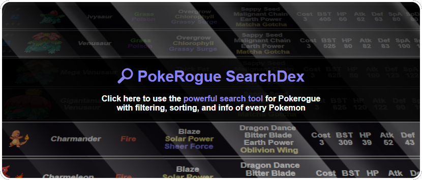

## This is the repository for Sandstorm's [PokéRogue SearchDex](https://sandstormer.github.io/PokeRogue-Dex/), a fast and powerful way to search all the data in PokéRogue, with intuitive UI and advanced filtering. 
You can see which Pokémon learn a move and when they learn it, who has variant shinies, who has the highest stats, which biomes or eggs to find Pokémon, and much more. I have also released the [updater scripts](https://github.com/Sandstormer/SearchDex-Updater), which I run offline to update the website, so that this project is fully open source.

❔ See the help screen for instructions and a list of available filters.

🌐 The UI is available in 6 languages, with nearly complete translations.

⭐ If you enjoy my Pokédex, please share the link with other players, and leave me a star on Github!

## Development

🔧 I regularly update this project with new features, and to reflect changes made to [the game](https://pokerogue.net/). If you have comments, message me on Github or the PokéRogue Discord.

## Disclaimer

I worked really hard on this project, so if you want to use any part of my code in your own project, please let me know first. Do not host a copy of this project.

I do not collect any personal data or have any way to identify repeat visitors. The site uses local storage only to remember your language selection. I use analytics on the site to see basic anonymized metrics. This helps me see how many people use the site, as well as things like screen size or browser language, so that I can prioritize developing new features. I do not distribute this data to third parties. If you do not wish to be counted in the stats, a simple adblocker will completely disable the analytics.

Images and game data are from the [PokéRogue Github](https://github.com/pagefaultgames/pokerogue). All asset rights are retained by their original creators.
